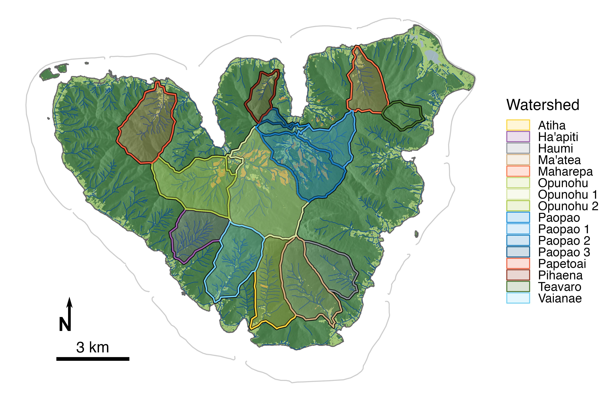
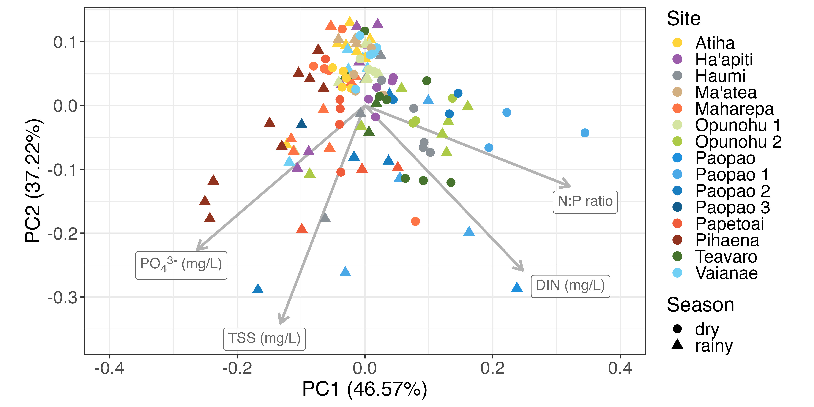

## README

### Repository for code and data visualization supporting:

Neumann, K., John, C., Atger, T., Punu, T., Hollarsmith, J.A., and Burkepile, D.E. 2025. Land use shapes riverine nutrient and sediment concentrations on Moorea, French Polynesia. *Scientific Reports*.

Please note that code is stored in the `./scripts/` subdirectory; plot outputs are stored in the `./plots/` subdirectory; and tables are stored in the `./tables/` subdirectory. For Figures 1 and 5, additional formatting was performed in Inkscape (added a North arrow in Fig 1 and a rainy/dry season annotation in Fig 5); the intermediate .svg and final .jpg figures are stored in the `./figures/` subdirectory.

Core data collected for this paper can be found on [EDI](https://doi.org/10.6073/pasta/a882a1478cdf99da4473449024f26229) and should be saved to the `./data/` subdirectory if working in an `.Rproj` environment. Land cover data are also stored on [EDI](https://doi.org/10.6073/pasta/9ca1465db64e4b8f38782b857f58f710) and are pre-summarized in the `./data/` subdirectory here. Ancillary data came from MeteoFrance and other official sources (relevant spreadsheets in the `./data/` subdirectory).

### Guide to code:

-   `000_colorPalettes.R` contains a modified version of `ggsci`'s Simpsons color palette

-   `001_maps.R` generates a map of Moorea with the relevant watersheds highlighted (this is Figure 1 in the manuscript)

-   `002_meteoFrance.R` summarizes precipitation data from MeteoFrance and plots a monthly time series (this is Figure 2 in the manuscript)

-   `003_census.R` includes code to summarize Moorea census data by watershed and visualize overlap between census districts and watershed boundaries. Census data are private and cannot be shared.

-   `010_results.R` includes all code to reproduce results, tables, and remaining figures in the manuscript and supplement. Note that any sentence in the manuscript's results section can be searched in this file and you will find the relevant code snippet to produce that result or figure.

